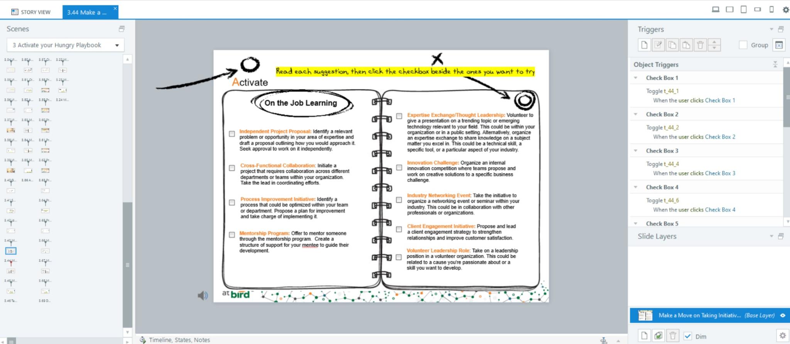

# DevLearn

# Storyline Print PDF Script Documentation

## Problem

In our Storyline course, we have multiple slides containing questions for students to answer. At the end of the course, we want to provide a "Print" button on the final slide, allowing users to print or download all their answers in a single document.

## Use Case

- The user navigates through several content slides in the course.
- After some slides, a question slide appears where the user must answer based on the content presented.
- 
- The user continues reading more content slides, followed by more question slides.
- At the end of the course, the user sees a single button labeled "Print/Download," which allows them to print or download all their answers.


## Why We Didn't Use Existing Solutions

Storyline offers basic print functionality, but it only allows printing the current slide. We needed a solution to print answers from multiple slides with a single button. Existing solutions like `jsPDF` and other libraries offer limited customization for creating complex PDF templates that match our course design. Therefore, we created a custom solution.

## Our Solution

We developed a custom workflow for printing and downloading all question responses at once, following the same template as the slides.

### Capturing User Responses

- On each question slide, we added Object Triggers to store the user's answers in uniquely named variables (e.g., `t_22_1`, `t_85_8`).
- Since the answers are "Yes/No," we saved them as boolean values in these variable

### Final Slide with Print Button

- On the final slide, a "Print" button with a JavaScript trigger collects all stored answers and sends them to a custom webpage, where the data is formatted into a print-friendly template.


### JavaScript Code Explanation

```javascript
var player = GetPlayer();

const paramsObj = {
    t_22_1: player.GetVar("t_22_1"),
    t_22_2: player.GetVar("t_22_2"),
    t_22_3: player.GetVar("t_22_3"),
    ...
    t_85_8: player.GetVar("t_85_8"),
    t_85_9: player.GetVar("t_85_9"),
    t_85_10: player.GetVar("t_85_10"),
}

let queryParam = '';
for (const [key, value] of Object.entries(paramsObj)) {
    if (!value) {
        queryParam = `${queryParam}&${key}=false`;
    }
}
queryParam = queryParam.replace('&', '');

let newWindow = window.open(`https://webUrl?${queryParam}`, '_blank');
```

- This script collects answers from Storyline's player, stored in variables using triggers on the question slides.
- It builds query parameters from these variables and passes them to a custom webpage.

### Webpage Processing

The custom webpage processes user answers using another JavaScript script, dynamically generating the content that the user will print.

```javascript
window.onload = function () {
    setTimeout(window.print(), 500);

    var search = location.search.substring(1);
    const params = JSON.parse(
        '{"' + search.replace(/&/g, '","').replace(/=/g, '":"') + '"}',
        function (key, value) {
            return key === "" ? value : decodeURIComponent(value);
        }
    );

    for (const [key, value] of Object.entries(params)) {
        if (value !== "true") {
            const element = document.getElementById(key);
            element.classList.add("disable");
        }
    }
};
```

- This script parses query parameters from the URL and converts them into a readable format.
- For each "No" answer, it assigns a `disable` class to the corresponding HTML element, styled with CSS to appear grayed out.
- Finally, `window.print()` opens the print dialog.

### Customizing the Design

```css
.disable { color: gray; }
```


This approach allows us to create a print-friendly, custom-designed document matching the layout and design of our course, which would be more challenging with `jsPDF` alone.

## Conclusion

By using this solution, we overcame the limitations of Storyline's built-in print functionality and external libraries. This approach allows us to gather all user responses across multiple slides and present them in a custom template for printing or downloading, enhancing the user experience.
